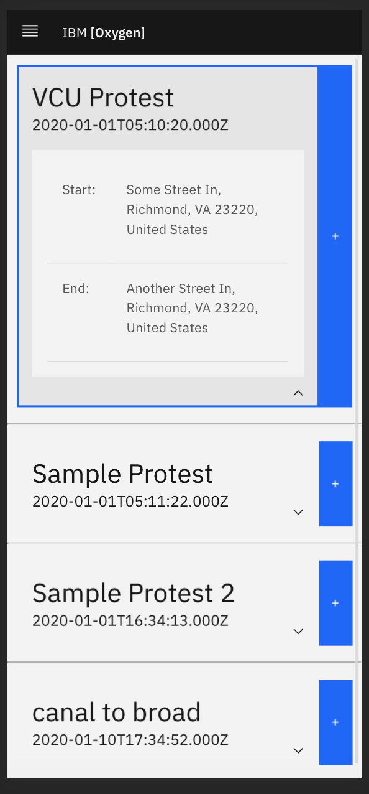
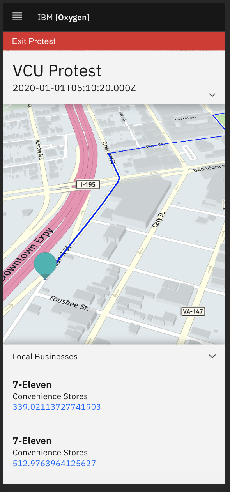
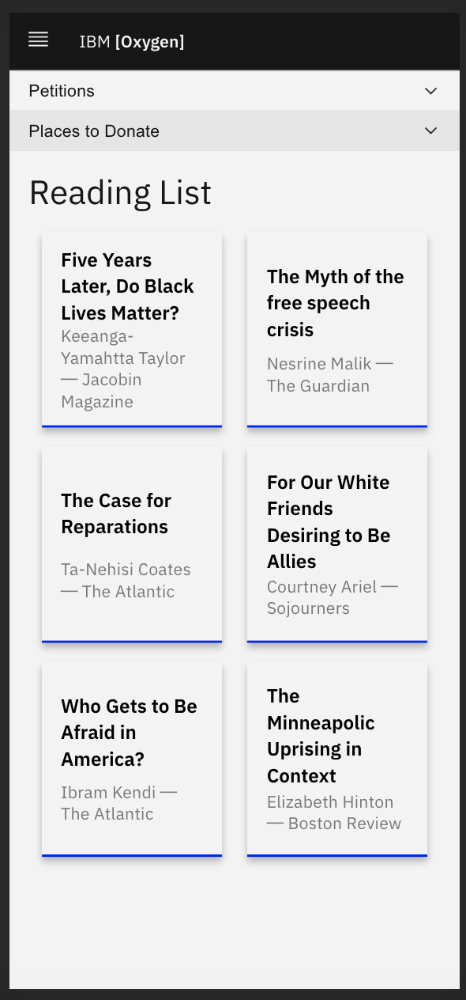
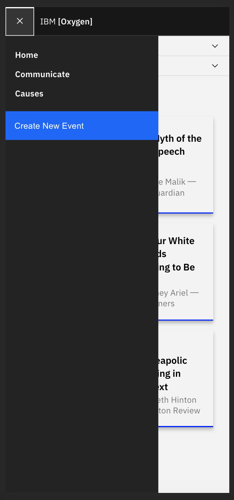

# Oxygen
Oxygen is a platform designed to keep protesters safe and informed while find and plan local events.

To run via localhost:

1. $ git clone [repo]
2. In one session:
	- cd /server
	- $ npm install
	- $ npm start
3. In one session:
	- cd /client
	- $ yarn install
	- $ yarn start
4. Navigate to localhost:3000

